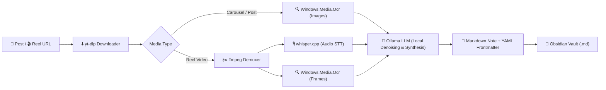

# Distill ⚡

> **Local-First Instagram Reel & Post Knowledge Extraction for Obsidian**

[](https://dotnet.microsoft.com/)
[](https://learn.microsoft.com/en-us/windows/apps/winui/winui3/)
[-white?logo=ollama&logoColor=black)](https://ollama.com/)
[](https://obsidian.md/)
[](#zero-cloud-privacy)

**Distill** is a native Windows desktop application built with WinUI 3 and .NET 8 that transforms educational Instagram content (multi-slide carousel posts and video Reels) into clean, structured, and richly formatted Markdown notes saved directly into your local [Obsidian](https://obsidian.md) vault.

Never lose actionable knowledge in Instagram's "Saved" bookmark abyss again.

---

## 🎯 How It Works



### 1. Carousel / Image Post Path
1. **Download**: `yt-dlp` fetches all high-resolution carousel slides.
2. **OCR**: Native `Windows.Media.Ocr` extracts on-screen text, headings, diagrams, and slide quotes.
3. **LLM Distillation**: Raw OCR text is passed to a local Ollama model (e.g. `llama3.2:3b`, `qwen2.5:7b`) to remove boilerplate, correct OCR typos, extract key takeaways, and format clean Markdown.
4. **Vault Output**: The note is formatted with YAML frontmatter (source URL, author, date, tags) and written directly to your configured Obsidian vault.

### 2. Video Reel Path
1. **Download & Demux**: `yt-dlp` downloads the video; `ffmpeg` separates the 16kHz WAV audio and samples video keyframes.
2. **Multimodal Extraction**:
   - `whisper.cpp` runs Speech-to-Text on the audio track.
   - `Windows.Media.Ocr` scans sampled video frames for on-screen text overlays.
3. **Synthesis**: Spoken transcript and visual frame text are combined and synthesized into a structured summary with key points and step-by-step instructions.
4. **Vault Output**: Markdown note is saved with full frontmatter, ready to open in Obsidian via `obsidian://` deep links.

---

## ✨ Key Features

- **100% Local-First & Zero Cloud Costs**: All OCR, audio transcription, LLM distillation, and file writing run entirely on your local machine with zero external cloud subscriptions or telemetry.
- **Zero-Python Distribution Architecture**: Native C# WinUI 3 desktop shell calling standalone native binaries (`yt-dlp`, `ffmpeg`, `whisper.cpp`), native Windows runtime OCR (`Windows.Media.Ocr`), and the local `Ollama` daemon—no brittle Python environments to bundle or break.
- **Seamless Obsidian Integration**: Direct file system writes with collision protection, tags (`#instagram/reel`, `#instagram/post`), and `obsidian://` URI launcher support.
- **Modern Fluent Design UI**: Windows 11 Mica backdrop, dark workspace theme, live 5-stage progress indicator, and clipboard auto-detection.

---

## 🏗️ Solution Architecture

```text
Distill.sln
├── Distill.App/                 # WinUI 3 Desktop Application (MVVM, XAML, DI Container)
│   ├── ViewModels/              # MainViewModel with CommunityToolkit.Mvvm
│   ├── MainWindow.xaml          # Fluent UI Window with Ingest & Progress Stepper
│   ├── App.xaml / App.xaml.cs   # Dependency Injection container setup
│   └── appsettings.json         # Local configuration file
│
├── Distill.Core/                # Domain & Core Pipeline (No UI dependencies)
│   ├── Configuration/           # DistillSettings options model
│   ├── Models/                  # DownloadResult, ExtractedContent, NoteMetadata
│   ├── Downloaders/             # IReelDownloader & implementations
│   ├── Ocr/                     # ITextExtractor (Windows.Media.Ocr)
│   ├── SpeechToText/            # ITranscriber (whisper.cpp)
│   ├── Formatting/              # INoteFormatter (Ollama HTTP client)
│   └── VaultWriter/             # IVaultWriter (Obsidian Markdown writer)
│
└── Distill.Tests/               # xUnit Unit Test Suite
    ├── StubPipelineTests.cs     # Verification of core interface contracts
    └── VaultWriterStubTests.cs  # Markdown & YAML frontmatter formatting tests
```

---

## 🚀 Getting Started

### Prerequisites

1. **Windows 10 (1809+) or Windows 11**
2. **.NET 8.0 SDK** (with Windows Desktop workload)
3. **Local Tools & Models**:
   - [Ollama](https://ollama.com/) running locally:
     ```bash
     ollama pull llama3.2:3b
     ```
   - [yt-dlp](https://github.com/yt-dlp/yt-dlp) and [ffmpeg](https://ffmpeg.org/) (installed in `PATH` or via `scoop install yt-dlp ffmpeg`).
   - [whisper.cpp](https://github.com/ggerganov/whisper.cpp) binary (e.g. `whisper-cli.exe` + `ggml-base.en.bin`).

### Configuration

Edit `Distill.App/appsettings.json`:

```json
{
  "DistillSettings": {
    "VaultFolderPath": "C:\\Users\\YourName\\Documents\\ObsidianVault\\Sources\\Instagram",
    "OllamaModelName": "llama3.2:3b",
    "OllamaEndpoint": "http://localhost:11434",
    "WhisperBinaryPath": "C:\\Tools\\whisper.cpp\\whisper-cli.exe"
  }
}
```

### Building and Running

```powershell
# Restore & build solution
dotnet build Distill.sln

# Run unit tests
dotnet test Distill.Tests\Distill.Tests.csproj

# Run WinUI 3 application
dotnet run --project Distill.App\Distill.App.csproj
```

---

## 📜 Documentation

Full engineering and design specifications are maintained in the [`docs/`](file:///e:/Coding/Projects/local-first%20Instagram%20%E2%86%92%20Obsidian%20knowledge%20extraction/docs) directory:

- [Project Overview](docs/project-overview.md) — Product requirements, user flows, and scope.
- [Architecture](docs/architecture.md) — System boundaries, data flow, and invariants.
- [UI Context](docs/ui-context.md) — Fluent Design guidelines, tokens, and layout patterns.
- [Code Standards](docs/code-standards.md) — C# 12/.NET standards and MVVM rules.
- [AI Workflow Rules](docs/ai-workflow-rules.md) — Phased development workflow and scoping boundaries.
- [Progress Tracker](docs/progress-tracker.md) — Current phase, completed work, and roadmap.

---

## 📄 License

MIT License. Feel free to use, modify, and distribute.
