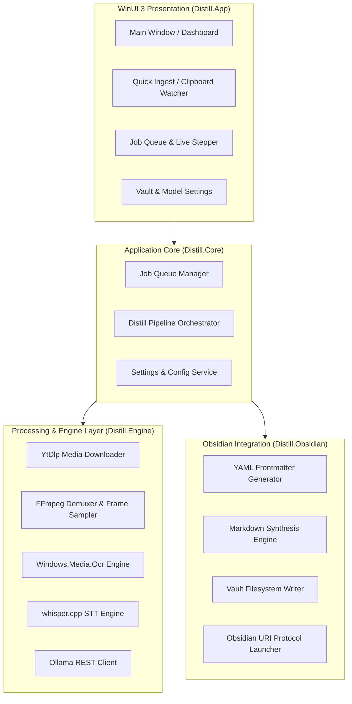
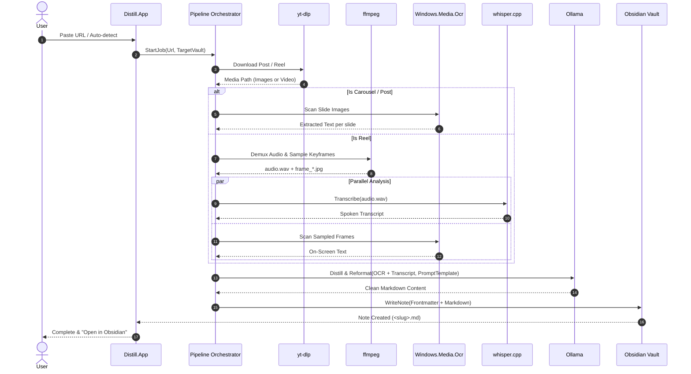

# Architecture Context

## Stack

| Layer | Technology | Role |
| --- | --- | --- |
| **UI Framework** | WinUI 3 (Windows App SDK) + C# (.NET 8/9) | Fluent Design desktop interface, queue management, preview, settings |
| **MVVM & DI** | `CommunityToolkit.Mvvm`, `Microsoft.Extensions.DependencyInjection` | ViewModels, reactive bindings, commands, service container |
| **Downloader** | `yt-dlp` (Subprocess CLI) | Reliable media download & metadata extraction for Instagram posts/reels |
| **Media Processing** | `ffmpeg` (Subprocess CLI / FFMpegCore) | Audio demuxing (16kHz WAV extraction) & video frame sampling (PNG/JPG) |
| **OCR Engine** | `Windows.Media.Ocr` (Native WinRT API) | Native Windows hardware-accelerated text extraction from images & frames |
| **STT Engine** | `whisper.cpp` (Native CLI / P-Invoke DLL) | Standalone local Speech-to-Text transcription with timestamps |
| **LLM Distillation**| `Ollama` (Local REST API `http://127.0.0.1:11434`) | Text cleanup, denoising, summarization, and markdown synthesis |
| **Storage & Output**| Local Filesystem (`.md` direct write) | Obsidian vault file creation with YAML frontmatter + `obsidian://` URIs |

---

## System Boundaries



### Module Responsibilities

- **`Distill.App` (WinUI 3)**: Owns UI controls, Fluent styling, ViewModels, notifications, clipboard listener, and user interaction. Does not contain raw pipeline or file I/O logic directly.
- **`Distill.Core`**: Owns domain models (`DistillJob`, `JobStatus`, `JobType`, `ExtractionResult`), queue scheduling, pipeline orchestration, event publishing, and persistent settings management.
- **`Distill.Engine`**: Owns subprocess runners and service abstractions for external tools (`yt-dlp`, `ffmpeg`, `whisper.cpp`, `Windows.Media.Ocr`, `OllamaClient`). Provides unified interfaces:
  - `IMediaDownloader`
  - `IMediaProcessor`
  - `IOcrEngine`
  - `ISpeechToTextEngine`
  - `ILanguageModelClient`
- **`Distill.Obsidian`**: Owns vault directory discovery, template rendering, slug generation, frontmatter generation, safe file writing, and `obsidian://` deep link execution.

---

## Processing Pipeline



---

## Storage Model

- **Configuration Storage**: `%LOCALAPPDATA%/Distill/config.json` stores user preferences (Obsidian vault paths, default folders, model names, template settings).
- **Temporary Scratch Storage**: `%LOCALAPPDATA%/Distill/temp/<job-id>/` stores intermediate media:
  - `media.mp4` / `slide_01.jpg`...
  - `audio.wav` (16kHz mono)
  - `frames/frame_001.jpg`...
  - Scratch directory is pruned automatically upon job completion unless debug retention is toggled.
- **Obsidian Output Storage**: Directly writes Markdown files to the user's selected vault:
  ```text
  <ObsidianVault>/
  └── <ConfiguredFolder>/  (e.g., Sources/Instagram/)
      └── 2026-08-23-instagram-account-name-short-title.md
  ```

---

## Auth and Access Model

- **Zero Cloud Accounts**: Distill requires no authentication, login, or cloud service connection.
- **Instagram Authentication**: For public posts/reels, no authentication is needed. For age-gated or private account content accessible to the user, Distill supports pointing `yt-dlp` to browser cookies (`--cookies-from-browser` or a `cookies.txt` file).
- **Local Network Permissions**: Distill communicates locally over loopback (`127.0.0.1:11434`) with the Ollama service.

---

## Invariants

1. **Strict Local-First Processing**: All OCR, Speech-to-Text, and LLM synthesis must run on localhost. No media or note contents may be sent to remote third-party AI APIs.
2. **Zero Python Runtime Requirement for Default Distribution**: Rely exclusively on native Windows APIs (`Windows.Media.Ocr`), compiled native binaries (`whisper.cpp`, `ffmpeg`, `yt-dlp`), and the standalone `Ollama` daemon.
3. **Responsive, Asynchronous Execution**: The UI thread must never block. All downloading, demuxing, inference, and file I/O must run asynchronously with cancellation token support and live progress reporting.
4. **Collision-Safe Vault Writing**: Existing Obsidian notes must never be silently overwritten. When a filename collision occurs, Distill will append an incremental slug or timestamp.
5. **Transient Media Cleanup**: Temporary video, audio, and frame artifacts must be cleaned up immediately upon job finalization to prevent disk bloating.
6. **Decoupled Architecture for Future Portability**: Pipeline abstractions in `Distill.Core` and `Distill.Engine` must have no hard dependency on WinUI 3 UI types, ensuring readiness for a future Android app, CLI runner, or background worker.
